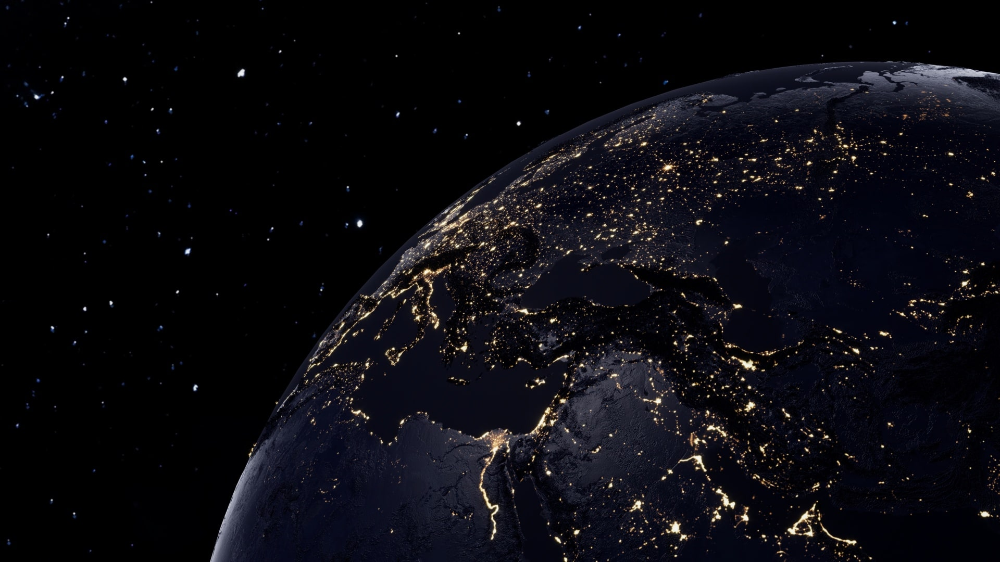

# eSPACE v2 🌎

**eSPACE v2** 🌎 is the **ultimate space explorer web** that brings the **wonders of the universe** right to your screen.  
Built by **Sanket Padhyal**, it combines **real-time space data using NASA APIs, ISS tracking, APOD galleries, planetary exploration, immersive Moon & Mars rovers, interactive quizzes, and AI interactions** — all in one seamless platform.

---

  
  

  
  
  
  
  

---

## ✨ Introduction

Welcome to **eSPACE v2** 🌎, a **dynamic web experience** where you can:

- Explore the **Solar System** and detailed **planetary data**  
- Track the **International Space Station (ISS)** in real-time with **speed, latitude, longitude, and night/day info**  
- Dive into **APOD (Astronomy Picture of the Day)** with a **parallax effect**  
- Explore **Moon Rover, Mars Rover, and Space Galleries**  
- Use **interactive quizzes** with over **3,000 space-related questions**  
- Ask an **AI bot** anything space-related or general  

This project combines **frontend interactivity**, **backend real-time APIs**, and **immersive learning** all in one platform.

---

## 🚀 Key Features

- 🌌 **Discover Space Planets:**  
  - All planets with detailed **data, facts, and discoveries**  
- 🛰️ **Track the ISS:**  
  - Real-time location:  
    - Latitude: 40.54°  
    - Longitude: 77.86°  
    - Speed: 27,590.43 km/h  
    - Time: Night/Day  
- 🖼️ **APOD Gallery:** Daily astronomy pictures with **interactive parallax scrolling**  
- 🚀 **Moon & Mars Rover Galleries:** Explore **rovers, missions, and images**  
- 🌠 **Space Gallery:** Stunning visuals of the cosmos  
- 🌡️ **Forecast Tracker:** Space weather and related info  
- 🤖 **AI Bot:** Ask anything about space or science  
- ❓ **Interactive Quizzes:** 3,000+ questions from JSON files, real-time scoring  
- 🎨 **Parallax & Multi-Panel UI:** Smooth scrolling effects for immersive experience  

---

## 🛠 Tech Stack

- **Frontend:** HTML, CSS, JavaScript, JSON  
- **Backend:** Node.js + JSON data  
- **Realtime Data:** ISS tracking, quiz scores, and updates  
- **NASA API:** Astronomy Picture of the Day (APOD), planetary data, rovers  
- **AI Integration:** Open Router API  
- **Hosting:** Netlify (Frontend) + Render (Backend)  

---

## ⚙️ How It Works

1. **Explore Planets:** Click any planet to see **detailed data and discoveries**  
2. **Track ISS:** View **real-time location and speed** with automatic updates  
3. **APOD Gallery:** Scroll to see **daily astronomy images** with parallax effect  
4. **Quizzes:** Take interactive **space quizzes** and track your score  
5. **Ask AI Bot:** Type any space-related question to receive **instant AI responses**  
6. **Galleries & Forecast:** Browse **rovers, space visuals, and weather info**  

---

## 🤝 Contribution & Support

- Contributions, **feature requests**, and **bug reports** are always welcome  
- Open **issues** or **pull requests** for improvements  
- Contact via GitHub for **direct queries**  

---

## 🖼️ Assets  

- Project includes a **background wallpaper (`assets/bg.jpg`)**.  

  

> 💡 Always compress or optimize background images for maximum performance, and fast loading.

---

## 🏷️ Ownership

Crafted with ❤️ and passion by **Sanket Padhyal**  
© 2025. All rights reserved  

---

## 🔗 Contact & Links

- **GitHub:** [https://github.com/SanketPadhyal](https://github.com/SanketPadhyal)  
- **Live Demo:** [Click Here!](https://espacev2.netlify.app/)  

---
